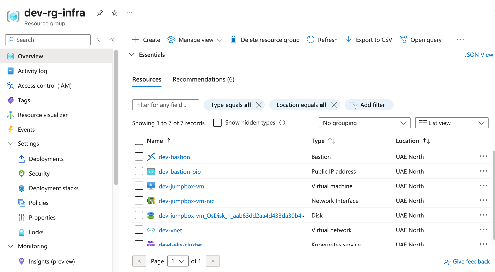
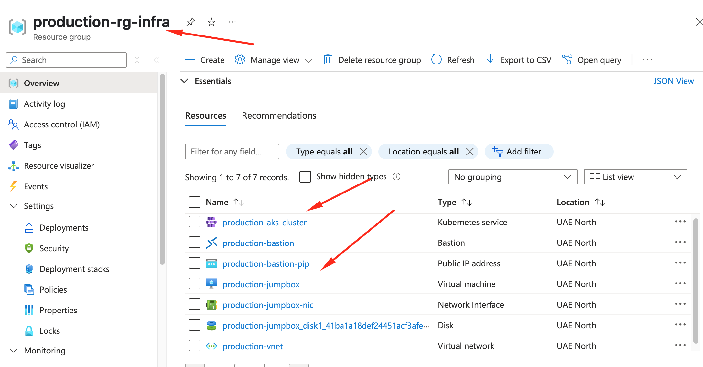
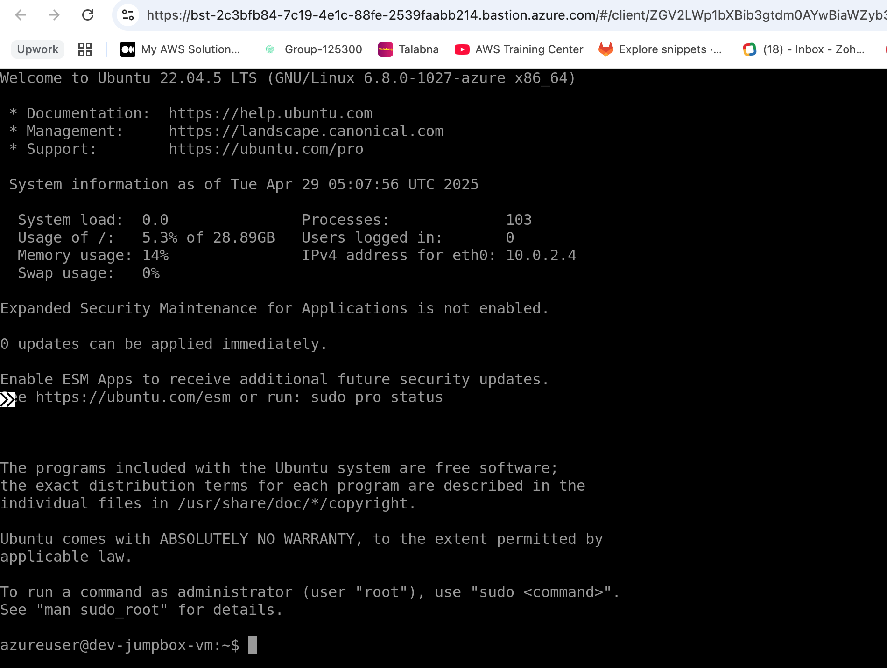
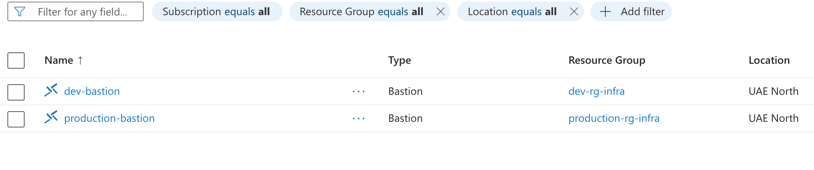
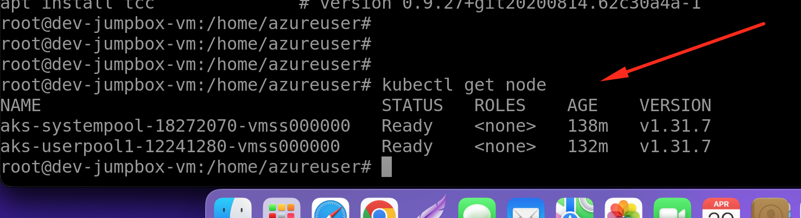

# ⚙️ Azure AKS Private Cluster with Terragrunt

This repository provides an environment-based Terragrunt setup to deploy a **Private AKS Cluster** in Azure, along with related infrastructure:

- 🌐 Virtual Network and Subnets
- 🔐 Azure Bastion Host
- 🖥️ Jumpbox Virtual Machine
- ☸️ Azure Kubernetes Service (AKS) Cluster

---

## 📁 Project Structure

```bash
.
├── environments/
│   ├── dev/                      # Development environment
│   │   ├── aks/                  # AKS component
│   │   ├── bastion/              # Bastion component
│   │   ├── jumpbox/              # Jumpbox component
│   │   └── network/              # VNet and Subnet component
│   └── prod/                     # Production environment
│       ├── aks/
│       ├── bastion/
│       ├── jumpbox/
│       └── network/
├── modules/                      # Reusable Terraform modules
│   ├── aks/
│   ├── bastion/
│   ├── jumpbox/
│   └── network/
├── provider.tf                  # Azure provider config
├── root.hcl                     # Terraform statefile configuration
└── README.md                    # This file
```

---

## 🔐 Authentication Setup

Before using Terragrunt, authenticate to Azure:

### Option 1: Azure CLI (local testing)

```bash
az login
```

### Option 2: Environment Variables (CI/CD or automation)

Export the following variables:

```bash
export ARM_CLIENT_ID="<app-client-id>"
export ARM_CLIENT_SECRET="<app-client-secret>"
export ARM_SUBSCRIPTION_ID="<your-subscription-id>"
export ARM_TENANT_ID="<your-tenant-id>"
```

---

## 🚀 Deploying the Infrastructure

You can deploy each component (network, bastion, jumpbox, aks) individually, per environment (e.g. dev or prod):

### Example: Deploy network for dev

```bash
cd environments/dev/network
terragrunt init
terragrunt plan
terragrunt apply
```

Repeat for:

- bastion
- jumpbox
- aks

⚠️ **Make sure to deploy in order**: network → bastion → jumpbox → aks

OR To deploy only Dev or Prod infra follow respective directory and Run following command

```bash
cd environments/dev/ or cd environments/prod/
terragrunt run-all init
terragrunt run-all plan
terragrunt run-all apply
```

---

## 🔄 Destroying Infrastructure

Destroy a component:

```bash
cd environments/dev/ or cd environments/prod/
terragrunt run-all destroy
```

<!-- To tear down everything, run `terragrunt destroy` in each module directory in **reverse order**:

```bash
aks → jumpbox → bastion → network
``` -->

---

## 📦 Features Summary

### 🔧 Modular & Reusable

- Each infrastructure component is modular and reusable across environments.
- Modules are under `modules/`, Terragrunt configs are in `environments/`.

### 📍 Private AKS Cluster

- Uses private networking (no public endpoint)
- Custom VNet and subnet assignment
- AAD-integrated with RBAC and OIDC enabled

### 🧑‍💻 Jumpbox VM

- Ubuntu VM deployed in a private subnet
- Accessed via Azure Bastion
- Authenticated via environment variables

### 🔐 Bastion Host

- Azure Bastion allows secure access without exposing public IPs

### 🔑 Secrets Management

Secrets like VM credentials and AAD group IDs are read via environment variables using `get_env()` in Terragrunt:

```hcl
admin_username      = get_env("TF_VAR_admin_username")
admin_password      = get_env("TF_VAR_admin_password")
tenant_id           = get_env("AZURE_TENANT_ID")
admin_group_object_ids = split(",", get_env("AZURE_ADMIN_GROUP_OBJECT_IDS"))
```

---

## 🧠 Useful Terragrunt Commands

- `terragrunt run-all plan` — Plan for all components
- `terragrunt run-all apply` — Apply all components
- `terragrunt run-all destroy` — Destroy all resources

<!-- Use `--terragrunt-include-dir` to limit scope if needed. -->

---

## 📸 Deployment Screenshots

### 1. Successful Terragrunt Apply - DEV RG



---

### 2. Successful Terragrunt Apply - PROD RG



---

### 3. Access JumpBox Server Through Bastion



---

### 4. Bastion Host



---

### 5. After assign Azure RBAC Kubernetes Role for your user.



---

## 👤 Developed & Maintained By

<!-- **Abdul Rahman UK**
[**LinkedIn**](https://www.linkedin.com/in/abdul-rahman-uk/)
[**Blog**](https://www.abdulrahmanuk.com) -->

**Abdul Rahman UK**  
LinkedIn: [www.linkedin.com/in/abdul-rahman-uk](https://www.linkedin.com/in/abdul-rahman-uk)  
Blog: [www.abdulrahmanuk.com](https://www.abdulrahmanuk.com)
